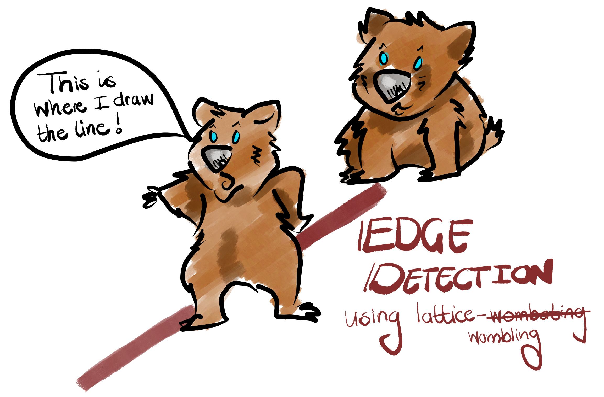
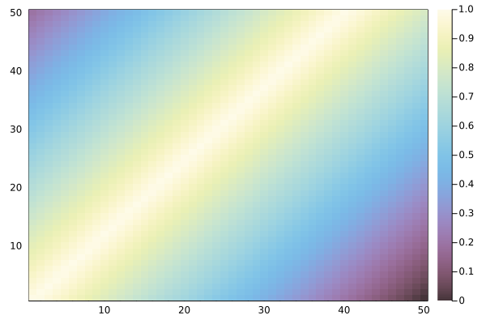
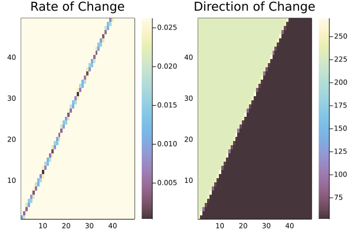
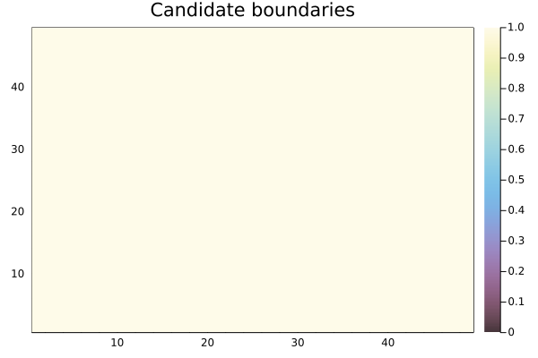

# README



````julia
import Pkg
Pkg.activate("/Users/tanyastrydom/Documents/Uni/project_wombat")
````

this can be pruned at some point...

````julia
using Base
using CSV: CSV
using DataFrames
using Delaunay
using LinearAlgebra
using SimpleSDMLayers
using SimpleSDMLayers: convert
using SpatialEcology
using Statistics
using StatsBase
using StatsPlots
using Plots

theme(:mute)
default(; frame=:box)
````

Import the functions and methods we need

````julia
include(joinpath(pwd(), "lib", "rateofchange.jl"))
include(joinpath(pwd(), "lib", "boundary.jl"))
include(joinpath(pwd(), "lib", "wombling.jl"))
````

## A Neutral landscapes example for lattice wombling

First we create a 50 x 50 'cell' landscape. In this
instance a planar landscape is it has a 'distinct'/sharp
boundary

````julia
using NeutralLandscapes
siz = 50, 50
A = Matrix(rand(EdgeGradient(), siz))
````

Plot the landscape so we have an _a priori_ idea
of what if looks like

````julia
plot(heatmap(A))

savefig("assets/PlanarLandscape.png")
````



Calculate the rate of change (𝑀) and direction of
change (θ) using `wombling()`

````julia
womble = wombling(A)

plot(
    plot(heatmap(womble.M), title = "Rate of Change"),
    plot(heatmap(womble.Θ), title = "Direction of Change")
    )

savefig("assets/PlanarWomble.png")
````



We can extract the candidate boundaries using the
rate of change caluclated from `wombling()`

````julia
boundary = boundaries(womble.M)

plot(
    heatmap(boundary),
    title = "Candidate boundaries"
)

savefig("assets/PlanarBoundaries.png")
````



